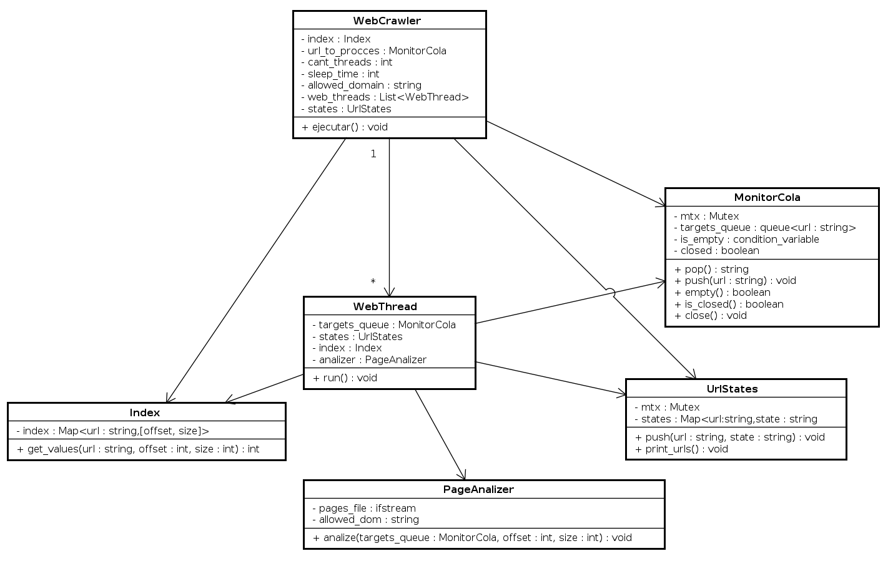
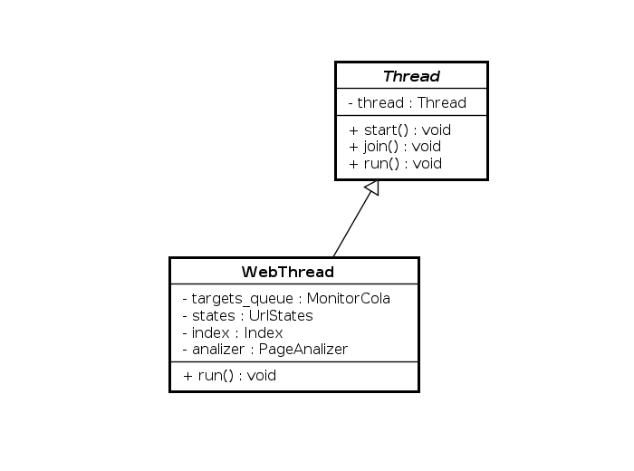
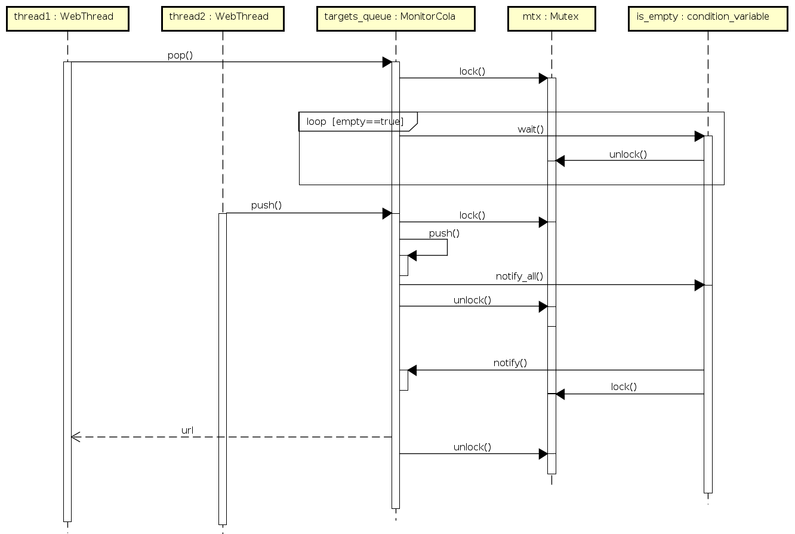

# Trabajo Practico 2 - Taller de programacion I

**Nombre:**  Santiago Pablo Fernandez Caruso

**Padron:** 105267

**Repositorio:** https://github.com/SaFernandezC/Tp2-Taller

## Descripcion

El presente trabajo consta de la implementacion de un programa que simula un Web Crawler en c++. El objetivo del trabajo es introducirse a la programacion multi hilo, aplicando programacion orientada a objetos y RAII.

## Detalles Implementacion

**General:**

A continuacion se presenta un diagrama de clases para ilustrar el modelo.

Como se puede apreciar en el diagrama, la clase WebCrawler tiene un vector de WebThreads los cuales son los encargados de realizar el proceso de busqueda y analisis de las paginas.

Todos los objetos del tipo WebThread comparten las mismas referencias a los objetos de tipo Index, MonitorCola y UrlStates propios de la clase WebCrawler. De forma contraria, cada WebThread tiene un objeto de tipo PageAnalizer ya que es donde se realiza el proceso de buscar y parsear para luego agregar las nuevas url a la cola de targets.

**WebThread:**

Se puede ver que la clase WebThread hereda de la clase padre Thread, la cual es una clase abstracta ya que su metodo run es abstracto. Es una implementacion similar a la vista en clase.

Los threads se instancian en el heap para evitar problemas.

**Clases Index, MonitorCola y UrlStates:**

La relacion entre estas 3 clases es que todos los threads comparten las mismas instancias de las mismas. Debido a ello se busco la manera de hacer que todos los metodos donde podria llegar a ocurrir una race condition sean thread safe. 

Para MonitorCola y UrlStates de utilizo un mutex pero para Index no fue necesario ya que su unico metodo es constante, esto quiere decir que no se producen cambios sobre los atributos de Index, solo se accede a los mismos.

Lo contrario pasa en las otras dos clases, los threads estan constantemente modificando los atributos de las mismas por lo que se utilizo un mutex para poder coordinar los accesos de los threads sin generar problemas.

En MonitorCola se implementa una cola con metodo pop bloqueante utilizando la documentacion provista por la catedra. El uso de una condition variable permite "dormir" el thread mientras que la cola este vacia y en el momento en otro thread hace un push se lo notifica para poder hacer el pop.  

En el diagrama se representa la secuencia de como interactuan los hilos con el monitor. En un primer momento la cola esta vacia y el thread1 quiere hacer un pop pero se bloquea hasta que el thread2 hace un push, luego el thread1 retorna con el pop.

**Detalles:**

Todas las clases son no copiables y las que lo permiten son movibles. En las clases que utilizan muten y condition_variables, como en las que hay referencias estan implicitamente eliminados los constructores. Segun la documentacion de c++, una clase tiene el operador de asignacion de movimiento eliminado si tiene algun miembro no estático de un tipo de referencia.

Para la implementacion de la clase Thread y el MonitorCola se uso como referencia lo visto en clase y los codigos de ejemplo dados por la catedra. 

